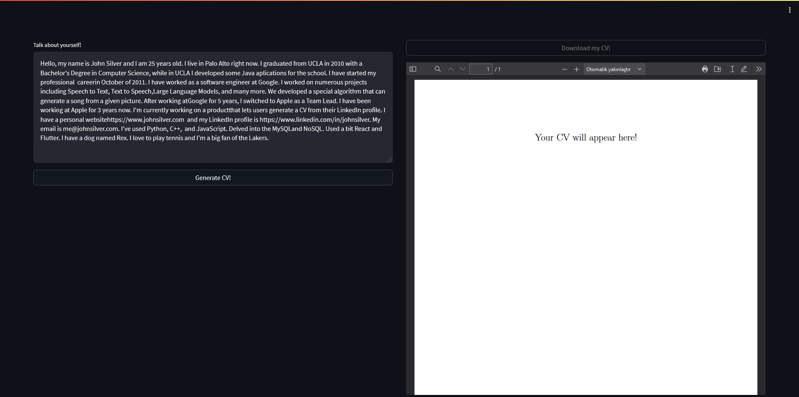
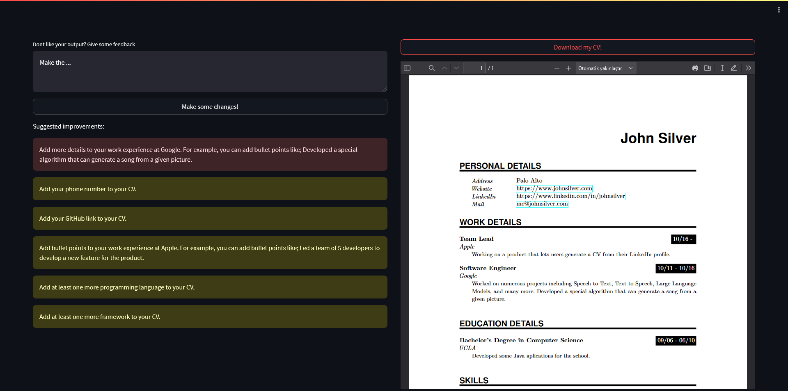

## CVBBB

**CV** **B**uilder **b**ut **B**etter

GPT meets LaTeX. Type what you did over the years and CVBBB will generate a nice looking CV for you.

## How to use?
- Run `docker run -d -e OPENAI_API_KEY=YOUR_TOKEN -p 8501:8501 ghcr.io/doneforaiur/cvbbb:main`.
- Open `localhost:8501` in your browser.
- Type your CV in the text area as plain text.
- Click on the `Generate CV` button.
- Preview the generated CV.
- Read the suggested improvements.
- Type your desired improvements in the text area.
- Preview the regenerated CV.
- Download the generated CV.

## Screenshots

## TODOs

- [x] Initial development.
- [x] Add a way to preview the generated CV without downloading it.
- [x] Add a way to let the user to make adjustments on the generated CV.
- [ ] Let users add a job listing and let CVBBB generate a cover letter.
- [ ] Let users add a job listing and let CVBBB generate a tailored CV.
- [ ] Add a way to determine profession specific "skills" section.
- [ ] Add more CV templates.

